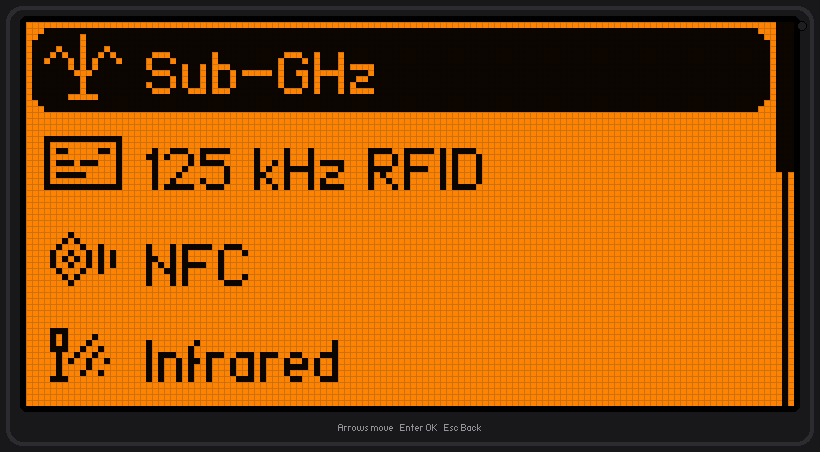
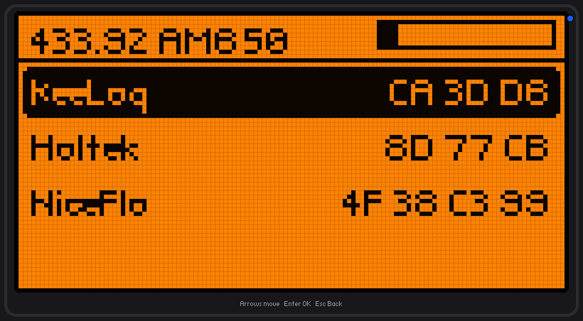
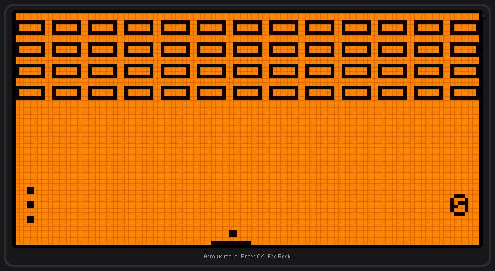

# Flipper Zero Emulator

A Flipper Zero that runs on your computer. It looks like the real thing (the
orange 128x64 screen, the menus, the little dolphin on the home screen) and has
the usual tools on it: Sub-GHz, NFC, 125 kHz RFID, Infrared, GPIO, iButton, Bad
USB and U2F.

Out of the box it runs in a simulation mode, so you can open every app and poke
around with nothing plugged in. If you want the radio stuff to actually do
something, you flash a small bridge firmware onto an Arduino or ESP32, plug it
into USB, and the emulator sends the Sub-GHz / NFC / IR / GPIO operations out
through that.

The version of this repo that was here before never actually worked (it was a
half-finished C project with most of the code missing), so this is a rewrite
from scratch. It's mostly Python, with a bit of C++ for the microcontroller side.

## Running it

You need Python 3.10 or newer.

On Windows, run `pyflipper.bat`. The first time it makes a virtual environment
and installs the two dependencies, then it starts. After that it just launches.

If you'd rather set it up by hand, or you're on Mac/Linux:

    python -m venv .venv
    .venv/Scripts/pip install -r requirements.txt     # Windows
    # ./.venv/bin/pip install -r requirements.txt      # Mac/Linux
    python -m pyflipper

Move around with the arrow keys, Enter is OK, Esc is Back.

A few flags if you need them:

    python -m pyflipper --sim          stay in simulation, ignore any hardware
    python -m pyflipper --port COM5    use a specific serial port
    python -m pyflipper --sd D:/flip   use a different SD card folder

## The SD card

Everything the emulator saves goes in the `sdcard` folder, laid out the same way
a real Flipper's card is (subghz, nfc, infrared, lfrfid, ibutton, badusb and so
on). The files use the actual Flipper file format, so a `.sub` or `.nfc` you save
here will open on a real Flipper, and files off a real Flipper open here too.

You can also point it straight at a real Flipper's SD card with `--sd`.

To add your own app, drop a folder in `sdcard/apps` with an `app.py` inside.
There's a small working example in `sdcard/apps/hello`. It turns up under
Applications the next time you start.

## The hardware bridge

Your computer doesn't have a sub-GHz radio or an NFC reader in it, so the
emulator hands those jobs to a microcontroller over USB. The firmware for that is
in the `firmware` folder, with wiring notes for a CC1101 (sub-GHz), a PN532 (NFC)
and an IR LED. Flash it to an ESP32 or Arduino, plug it in, then in the emulator
go to Settings > Hardware > Rescan. If nothing is connected it just carries on in
simulation.

It works on a bare board with no radio modules attached, so you can check the USB
link first before wiring anything up, then turn modules on one at a time.

## Running real Flipper apps (fapemu)

There is a second, separate thing in this repo: [`fapemu`](fapemu/), which runs
actual `.fap` applications — the same files you would copy onto a Flipper's SD
card — on your computer.

    python -m fapemu run apps/arkanoid.fap

It loads the `.fap`, relocates it, and executes its real ARM code on an emulated
Cortex-M4, trapping the firmware calls it makes and answering them in Python. So
the app itself genuinely runs; only the firmware underneath is substituted.

Of fourteen apps pulled from the official catalog, all fourteen load and run,
and eleven of them play properly - Arkanoid, Tetris, Snake, Game 15, Analog
Clock and friends. Apps built on the higher-level ViewDispatcher/scene framework
load and report what they need but do not run yet. See
[fapemu/README.md](fapemu/README.md) for the details and the full list of limits.

## Running the real firmware (experimental)

Separate from everything above, there's a rough attempt at booting the actual
Flipper firmware (Momentum, Unleashed, the official one) inside the Renode
emulator. Right now the firmware's code loads and the CPU starts running, but it
doesn't get all the way to the UI yet, and the radios can't work in emulation no
matter what you do. It's really a starting point for anyone who wants to dig into
it. Notes are in RENODE.md.

## What it doesn't do

It doesn't run compiled `.fap` apps, since those are ARM binaries built for the
real chip. Apps here are Python. The radio features are simulated unless you have
the bridge hardware. And Bad USB doesn't type into your PC, it just plays the
script back on the screen, because actually injecting keystrokes is the ESP32's
job when it pretends to be a keyboard, not something the emulator should be doing
to your machine.

## Credits

The original flippulator idea was Milk_Cool's. The screen font is HaxrCorp 4089
by sahwar (CC-BY-SA).

Only transmit on frequencies you're allowed to use where you live, and only touch
devices you actually own.
