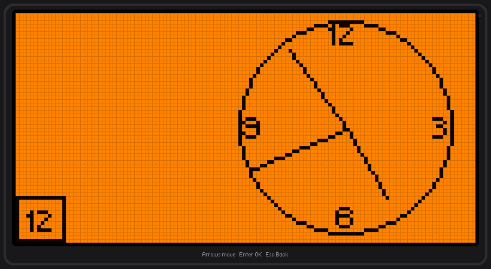
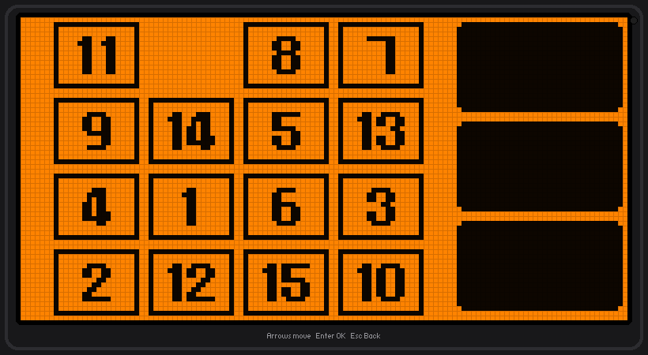

# fapemu

Runs Flipper Zero `.fap` applications on your computer.

This is separate from the emulator in the rest of this repo. That one is a
reimplementation: Python apps that look and behave like Flipper apps. This one
takes the actual `.fap` file you would copy onto a Flipper's SD card and runs
the real ARM code inside it.

    python -m fapemu run apps/snake.fap

## How it works

A `.fap` is not a normal program. It is a relocatable ARM (Thumb-2) ELF object
compiled for the Flipper's Cortex-M4, and it does not contain the functions it
calls. Things like `canvas_draw_str` or `furi_message_queue_get` live in the
firmware, and the Flipper's loader patches them in when the app is opened.

fapemu does the same job on the desktop:

1. **Load and relocate.** The ELF's sections are placed in an emulated address
   space and its relocations are applied, exactly as the firmware's loader does.
2. **Bind imports.** Every function the app imports is pointed at a small
   trampoline address. Data imports (like `_ctype_`) get real memory instead,
   because the app reads through them.
3. **Execute.** The app's own ARM instructions run on an emulated Cortex-M4
   (Unicorn). Nothing is recompiled or rewritten.
4. **Intercept.** When execution reaches a trampoline, it is trapped and a
   Python implementation of that firmware function runs instead, drawing onto a
   128x64 canvas and reading your keyboard.

So the application is genuinely running; only the firmware beneath it is
substituted.

The awkward part is that a Flipper app spends its life blocked on
`furi_message_queue_get`, waiting for a button. Rather than spin, fapemu parks
the app at that point, renders the screen and collects input, then resumes the
app where it stopped. Drawing works the other way round: the host calls back
into the app's own draw callback, which is real ARM code again.

## Commands

    python -m fapemu run <file.fap>      run it in a window
    python -m fapemu info <file.fap>     manifest, entry point, imports
    python -m fapemu list [dir]          list .fap files in a folder

Useful flags for `run`:

    --headless           no window, for testing
    --seconds N          stop after N seconds
    --screenshot out.png save the final frame
    --sd <dir>           folder to expose to the app as the SD card
    -v                   print the app's own log output
    --trace              log every firmware call the app makes

Controls are the same as the rest of this repo: arrow keys, Enter for OK, Esc
for Back.

## Tested with

Fourteen apps were downloaded from the official catalog (built for API 87.1) and
run. All fourteen load, relocate and execute without faulting. Eleven of them
draw and respond to input:

| works | app |
|---|---|
| yes | Analog Clock, Arkanoid, Calculator, Counter, Dice D&D, Flashlight, Game 15, Metronome, Paint, Snake 2.0, Tetris |
| loads, does not draw | DOOM (spends its time in a worker thread, see limits), Text Viewer and Text to SAM (ViewDispatcher apps) |

Snake writes its high score through the emulated storage API and it lands in
`sdcard/data/`, so file access works end to end.

## What it supports

Around 180 firmware functions are implemented: the whole ViewPort/Canvas
drawing API, message queues, mutexes, timers, threads (run inline), FuriString,
notifications, `elements_*` helpers, a `printf` implementation, the common libc
routines, and file access mapped onto a folder on your disk.

`info` tells you whether a particular app needs anything that is missing:

    python -m fapemu info apps/thing.fap

## Known limits

- **ViewDispatcher apps do not run.** Apps built on the higher-level
  `view_dispatcher` / `scene_manager` / `widget` / `text_input` framework load
  and report cleanly but exit immediately, because those modules are stubs. Apps
  that drive a ViewPort directly (most games and small tools) work.
- **Icons are not drawn.** `canvas_draw_icon` needs the firmware's compressed
  icon format decoded, which is not implemented. `canvas_draw_xbm` does work.
- **No radios.** There is no Sub-GHz, NFC, RFID or infrared here. An app that
  tries to use them gets stubs. For real hardware see the bridge firmware in
  `firmware/`.
- **Threads run inline.** There is no scheduler, so `furi_thread_start` runs the
  thread body at the point it is started. A worker that loops forever never
  gives control back, which is what stops DOOM from getting as far as drawing.
- **API version.** Targets API 87.1 (firmware 1.4.x / Momentum mntm-012). Apps
  built against a very different API may import functions that do not exist here.

## Layout

    fapfile.py    parse the ELF and the .fapmeta manifest
    loader.py     place sections, apply relocations, bind imports
    machine.py    the emulated Cortex-M4: memory, registers, call plumbing
    memmap.py     address space layout
    api/          the firmware functions, implemented in Python
    env.py        host-side state the API works against
    display.py    the window
    runner.py     the loop that runs an app and services it while it waits
